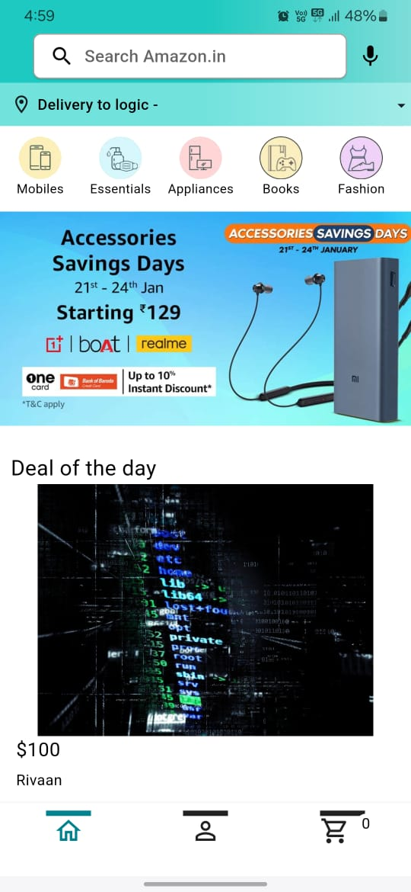

# Amazon Clone Flutter App

Welcome to the Amazon Clone Flutter App! This mobile application provides a user-friendly interface for browsing products, placing orders, and managing user accounts, leveraging the backend server for data management and authentication.

## Features

### Authentication
- **User Authentication**: Users can sign up, log in, and manage their accounts securely.

### Product Management
- **Browse Products**: Users can view a list of available products with details such as name, description, images, price, and ratings.
- **Search Products**: Users can search for specific products based on name, category, or price range.
- **Product Details**: Users can view detailed information about each product, including images, descriptions, and ratings.

### Shopping Cart
- **Add to Cart**: Users can add products to their shopping cart for later purchase.
- **View Cart**: Users can view the contents of their shopping cart, including product details and quantities.
- **Update Cart**: Users can update the quantity of products in their cart or remove items altogether.

### Ordering
- **Place Order**: Users can place orders for products in their cart, specifying shipping address and payment method.
- **Order History**: Users can view their order history, including details such as order date, total price, and status.

### User Profile
- **View Profile**: Users can view their profile information, including name, email, and address.
- **Update Profile**: Users can update their profile information, such as changing their address or password.

## Screenshots

<em>Admin Homepage</em>

<em>Admin Total Sales</em>

<em>Admin Add Products</em>

<em>Shopping Cart</em>

<em>Homepage</em>

<em>More Features</em>

## Installation

### Prerequisites
- Install Flutter SDK and set up your development environment.
- Ensure the backend server is running and accessible from the Flutter app.

### Installation Steps
1. Clone the repository to your local machine.
2. Navigate to the project directory.
3. Run `flutter pub get` to install dependencies.
4. Update the backend server URL in the app to point to your server.
5. Run the app on an emulator or physical device using `flutter run`.

## Contributing

Contributions are welcome! If you have any suggestions, bug fixes, or new features to propose, please submit a pull request or open an issue on GitHub.

## Acknowledgments

We extend our gratitude to the creators of the backend server for providing the foundation for this application.

Thank you for using the Amazon Clone Flutter App! Should you have any questions or feedback, feel free to reach out.
